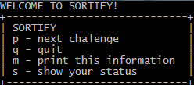

# Relatório Sortify
## Rookies
##### João Matos 21901219, André Figueira 21901435, Rúben Cerqueira 21902961

---

Quando o jogo é iniciado, é imprimida a MSG_Welcome, e é chamada a função void print_menu(void), para o menu de jogo ser imprimido.

O jogo recebe uma seed, que caso não seja especificada, é gerada baseada no tempo atual.
>Para esta parte do trabalho tivemos a ajuda do nosso colega `Daniel Fernandes`

---

A partir deste momento o jogo espera pelo _input_ do jogador, usando o _scanf_ dentro de um ciclo _do while_. Para comparar o _input_ do jogador com os esperados do menu foi usado um _switch_ com os casos respetivos aos caracteres do menu. Se o caracter dado pelo jogador não corresponder a nenhum do menu, é apresentada a `MSG_UNKNOWN`. 

Explicando cada caso:

* Caso `p`: No início do caso 'p' é usado um ciclo _for_ onde é gerado o intervalo de valores consoante o nível do jogador, dentro deste _for_ são usados um _if_ e _else if_ onde o primeiro corresponde ao primeiro nível e os outros consequentemente, nos _else if_.

  Após os níveis estarem definidos, a mensagem `MSG_SORT` é imprimida, e os números gerados anteriormente também. De seguida, é usado o _scanf_ para o programa ler o _input_ do jogador, recebendo os 4 números separados por espaços entre si. Depois, é definida uma variável do tipo inteiro `unsorted` que é igual a 1, iniciando assim um ciclo _while_ onde essa mesma variável é alterada para 0, e verifica se os números estão ordenados. Caso pelo menos um dos números não esteja ordenado, a váriavel volta a ser 1 e o ciclo repete-se, até que todos os números estejam ordenados e a variável não seja alterada para 1, saíndo assim do ciclo _while_. De seguida, é iniciado um ciclo _while (unsorted)_  onde a variável `unsorted` é definida para 0. Depois é começado um _for_ que corre os primeiros três números comparando-os um a um com o próximo (apenas os primeiros 3, pois o terceiro será comparado com o quarto, ordenando assim todos no fim do ciclo _while_). Depois é usado um _for_ com o objetivo de verificar se os números que o jogador submeteu, são os mesmo que os números gerados, independentemente de estarem por ordem ou não. É também inicializada a variável `present`, que verifica se os números estão presentes, ou seja, se um número não estive presente no _array_, essa variável é alterada para 0, imprimindo a mensagem `MSG_SORT2` voltando assim ao início do ciclo onde estava, pedindo ao jogador para inserir os números ordenados de novo.
  
    No ciclo _while_ seguinte, se `present` for igual a 0, significa que o jogador não digitou os números presentes no nível, sendo que o _loop_ continuará até serem inseridos os números que foram pedidos, lembrando que este loop serve só para esse fim e não para colocar os números por ordem crescente.
    A seguir há um incremento das jogadas que só são contadas as jogadas em que o jogador colocou os números na ordem certa ou na ordem errada e não conta as jogadas em que o jogador digitou outros números diferentes dos que o nível pede, ou seja, só após sair do loop anterior, será incrementado o número de jogadas.
    Depois há um ciclo _for_ que compara os números inseridos com os números ordenados e se a ordem estiver errada, automaticamente aparece a mensagem de que está errada, e volta a pedir para o jogador digitar os números na ordem certa e se for esse o caso, passa para o nível seguinte, e é mostrada a mensagem `MSG_WELL`. De seguida os pontos obtidos nessa jogada são somados para a pontuação atual. 
    Depois o _gameScore_ serve para aplicar à pontuação a subida de nível a cada 10 pontos (10, 20, 30...), até chegar ao nível 6, onde avisa o jogador que chegou ao fim, ganhando o jogo.
    As condições que se seguem acontecem quando o jogador chega ao nível 6. É mostrada a mensagem `MSG_WIN` seguida do quadro com a pontuação, nível e jogadas (status). Depois a mensagem `MSG_OVER` é mostrada para terminar o jogo. De seguida há um _else if_ para quando o jogador atingir o limite máximo de jogadas antes de chegar ao nível 6 imprime a mensagem `MSG_MAX` e mostra também o nível, pontuação e jogadas (que neste caso são as jogadas máximas permitidas neste jogo), a seguir é imprimida a mensagem `MSG_OVER` e termina o jogo. Se o jogador chegar ao nível 6 na 30ª jogada, o jogo é ganho à mesma, pois a verificação das jogadas é feita depois.

* Caso `m`: A função `print_menu` é chamada, e o jogador volta a ver o menu.

* Caso `s`: É chamada a função `print_status` onde é mostrado as estatísticas do jogador.

* Caso `q` : É chamada a função `print_status` onde é mostrado as estatísticas do jogador, é imprimida a `MSG_BYE`, e o jogo acaba.

* Caso `default`: Se nenhum dos caracteres for reconhecido a `MSG_UNKNOWN` é imprimida.

---

## Sortify Extra (pontuação x tempo)

Falando do extra deste mini projeto, foram criadas duas variáveis globais, uma para receber o tempo atual no início da jogada (startTime) e outra para fazer a diferença do tempo atual com o tempo inicial, no fim da jogada, obtendo assim o tempo demorado a jogar. O jogador recebe 10 pontos se demorar 5 segundos ou menos, sendo que a partir dos 5 segundos, é descontado um ponto por segundo, até ao minímo de 1 ponto por jogada. Esta função calcula a pontuação a atribuir e retorna a mesma para ser adicionada à variável `gameScore`, que é a pontuação do jogador no jogo atual.
> Como ajuda para fazer esta função, o grupo recorreu ao site [Geeks for Geeks.](https://www.geeksforgeeks.org/how-to-measure-time-taken-by-a-program-in-c/)

---

Este trabalho foi bastante educativo, pois ensinou-nos a trabalhar com os conteúdos da biblioteca `time.h` e `stdlib.h`.

Pusemos também em prática muitos dos conhecimentos que obtivemos em aula, sendo alguns deles o _switch_, a biblioteca `stdio.h`, uma boa organização do código, trabalho em equipa, e o uso do `git` para manter as várias versões do trabalho.